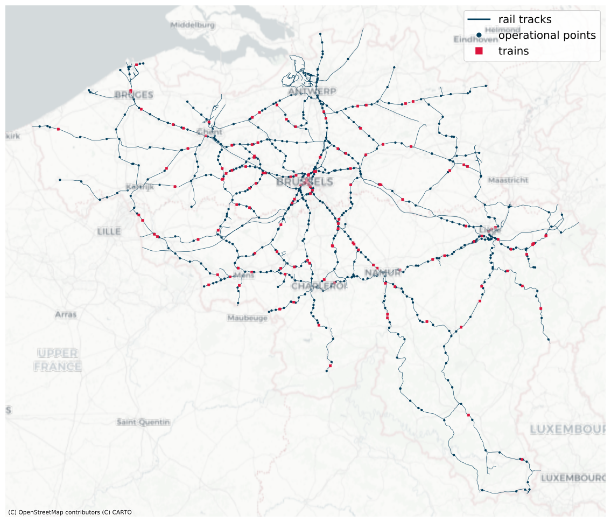

# RIDE: An Open Dataset and Benchmark for Train Delay Prediction

RIDE is an open dataset and benchmark for train delay prediction over the
Belgian railway network. It provides a reusable relational data release,
model-ready benchmark datasets with shared train/test splits, and a common
evaluation protocol for comparing train delay prediction models.

  

## Overview

RIDE is organized around four components:

- **Silver**: a reusable relational dataset over train events, journeys,
  railway infrastructure, and weather observations.
- **Gold**: a shared benchmark core with fixed train/test snapshots, prediction
  instances, target values, and a test evaluation table. Built on this shared
  core, Gold provides four model-ready datasets for downstream models: tabular,
  sequential, GNN, and graph-event. The Gold release is available in Lite and
  Standard tiers.
- **Evaluation protocol**: using the Gold core, all models are evaluated on the
  same prediction instances with unified metrics, including MAE, RMSE, and
  breakdowns by prediction horizon and delay change.
- **Benchmark**: a comparison of non-learning methods, with a Translation
  baseline and Graph-event model; statistical learning methods, with XGBoost;
  and deep learning models, with MLP, LSTM, Transformer, and GNN, using our
  evaluation protocol.

## Released Data Assets

| Asset | Description |
| --- | --- |
| [Silver](https://huggingface.co/datasets/ano6060/anonymous-ride-silver) | Reusable relational dataset for downstream dataset construction. |
| [Gold Lite](https://huggingface.co/datasets/ano6060/anonymous-ride-gold-lite) | Smaller benchmark tier for fast experimentation. |
| [Gold Standard](https://huggingface.co/datasets/ano6060/anonymous-ride-gold-standard) | Full benchmark tier used for the main paper results. |

## Repository Structure

| Path | Description |
| --- | --- |
| `src/` | Reusable Python code for source downloads, dataset construction, benchmark models, and evaluation utilities. |
| `configs/` | Dataset pipeline settings, selected benchmark model configurations, and Optuna search spaces. |
| `manifests/` | Executable Bronze and Silver table specifications: sources, outputs, transforms, checks, and field metadata. |
| `scripts/` | Command-line entry points for data download/build steps, benchmark training/evaluation, hyperparameter search, and figure generation. |
| `docs/` | Task-oriented guides for setup, repository structure, dataset download, extension, and paper reproducibility. |
| `notebooks/` | Interactive walkthroughs for inspecting Silver, understanding Gold, and running a benchmark training/evaluation flow. |

## What do you want to do?

**Get Started**

- [Install the project](docs/installation.md)
- [Understand the repository structure](docs/repo_structure.md)
- [Download the released datasets](docs/data_download.md)
- [Understand the Silver relational dataset](notebooks/understand_silver.ipynb)
- [Understand the Gold benchmark datasets](notebooks/understand_gold.ipynb)
- [Train a model and evaluate it](notebooks/train_and_evaluate.ipynb)

**Extend RIDE**

- [Modify the download, Bronze, and Silver pipeline](docs/modify_download_bronze_silver_pipeline.md)
- [Create a new Gold-core benchmark tier](docs/create_gold_core_benchmark_tier.md)
- [Create variants of existing model-specific Gold datasets](docs/create_existing_gold_dataset_variants.md)
- [Create your own model-specific Gold dataset](docs/create_gold_dataset.md)
- [Evaluate your model on the benchmark](docs/evaluate_model_on_benchmark.md)

**Reproduce the Paper**

- [Rebuild the data pipeline](docs/rebuild_paper_pipeline.md)
- [Reproduce the paper results](docs/reproduce_results.md)
- [Generate tables and figures](docs/generate_tables_figures.md)

## Benchmark Results

Main test-set results on the Gold Standard tier. MAE/RMSE are in seconds;
`±` is std. over 10 seeds.

| Model | MAE | RMSE |
| --- | --- | --- |
| Translation | 96.65 | 233.42 |
| Graph-event | 88.41 | 232.48 |
| MLP | 77.20 ± 0.04 | 203.21 ± 0.40 |
| XGBoost | 76.58 ± 0.01 | 203.46 ± 0.02 |
| LSTM | 74.62 ± 0.27 | 202.63 ± 0.77 |
| Transformer | 74.54 ± 0.25 | 195.39 ± 0.59 |
| GNN | **73.62 ± 0.19** | **194.56 ± 0.88** |

## Citation

Citation information will be added after de-anonymization.

## License

The source code in this repository is released under the MIT license; see
[LICENSE](LICENSE).

The released RIDE datasets are distributed under CC BY 4.0; see
[DATA_LICENSE.md](DATA_LICENSE.md). RIDE is derived from Infrabel Open Data
(CC0) and Open-Meteo API data (CC BY 4.0).
